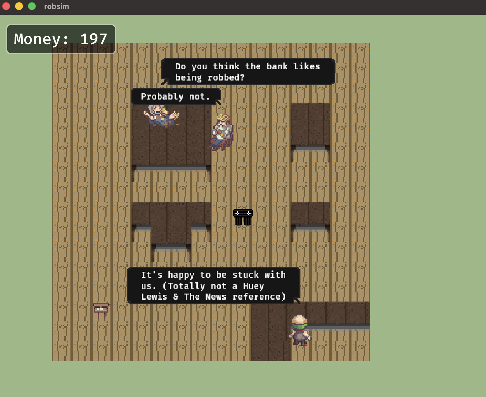
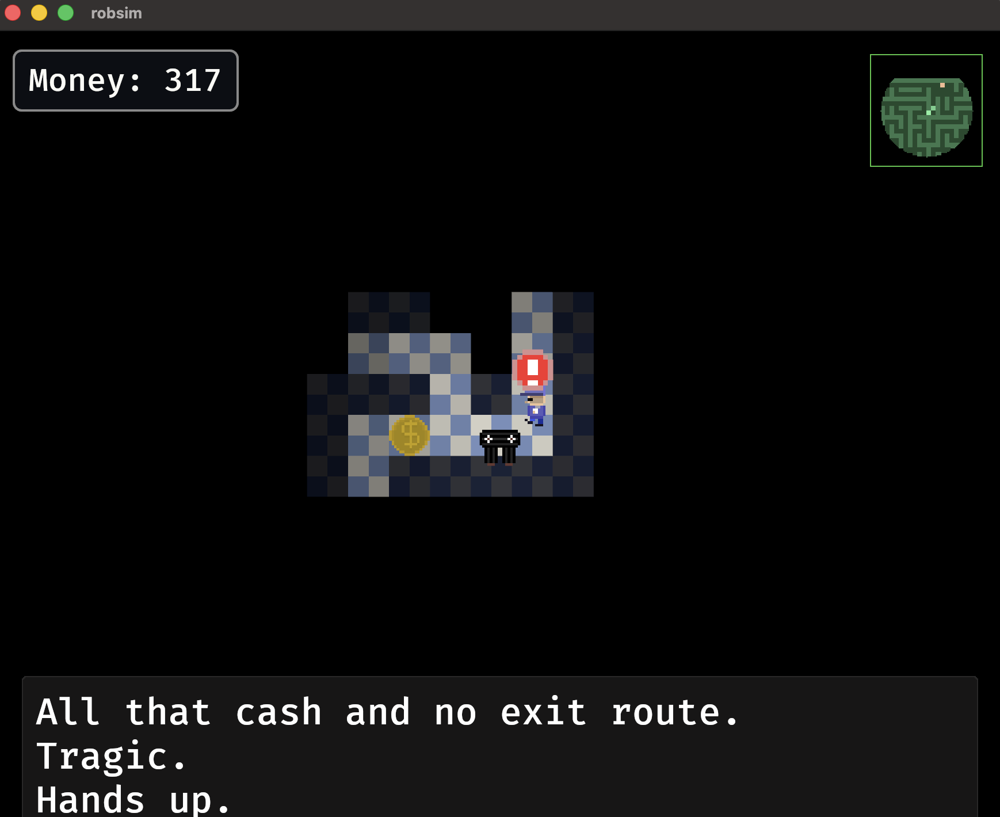

# Robsim

Once in a Blue Moon, the bank gets robbed. Unfortunately, the whole bank is a blue moon.

Blue Moon Bank gets robbed surprisingly often. Rob a bank, read the newspaper, and get roasted in the tavern.

## Core Loop

1. Enter Blue Moon Bank and press `F` to open the vault. The guards will soon become interested in your activities.
2. Rob the bank. Navigate a maze filled with guards while using your radar (top-right corner) to track their positions.

If you're successful:

3. Keep the money from the robbery.
4. New tavern dialogue and a newspaper article will appear.
5. View all of your robberies by visiting the house at the bottom of town and interacting with the chest.

If you're unsuccessful:

3. Get thrown in jail.
4. Ask the guard very nicely to let you out.
5. Visit the tavern to read the newspaper and see what the locals have to say about your performance.

## Screenshots




## Setup

1. Make sure you have rust installed
2. Run it!
```sh
cargo run # does everything
```

## Notes

I probably should've used Godot. I reinvented a lot of features from it. (just look at all the spec structs!)

The game probably looks ugly to you. But I like it, and that's what matters.