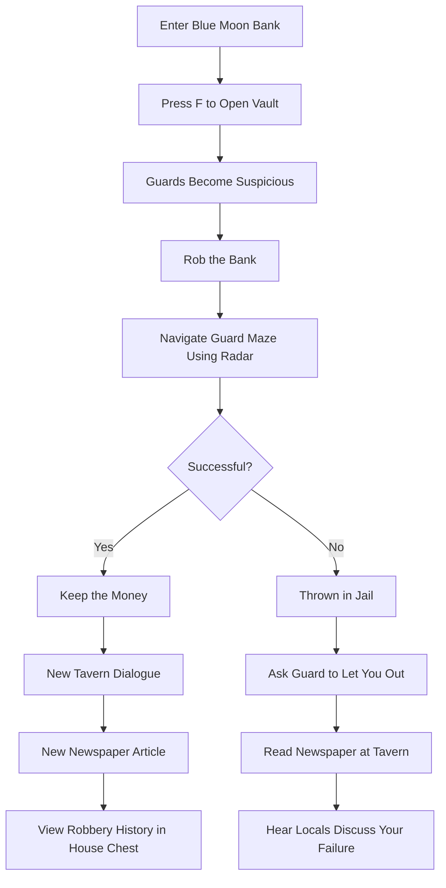

```mermaid
flowchart TD
    A[Enter Blue Moon Bank] --> B[Press F to Open Vault]
    B --> C[Guards Become Suspicious]
    C --> D[Rob the Bank]
    D --> E[Navigate Guard Maze Using Radar]

    E --> F{Successful?}

    F -->|Yes| G[Keep the Money]
    G --> H[New Tavern Dialogue]
    H --> I[New Newspaper Article]
    I --> J[View Robbery History in House Chest]

    F -->|No| K[Thrown in Jail]
    K --> L[Ask Guard to Let You Out]
    L --> M[Read Newspaper at Tavern]
    M --> N[Hear Locals Discuss Your Failure]
```